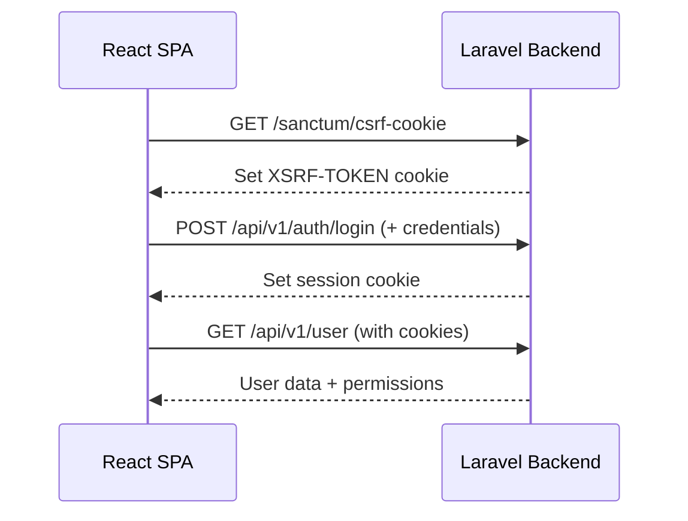

import { Aside, Steps } from '@astrojs/starlight/components';

XetaSuite utilise **Laravel Sanctum** en mode **stateful** (cookies) pour l'authentification SPA. Aucun token API n'est stocké côté client.

## Flow d'authentification



## Configuration Backend

### Sanctum (`config/sanctum.php`)

```php
'stateful' => explode(',', env('SANCTUM_STATEFUL_DOMAINS',
    'localhost,localhost:5173,127.0.0.1,xetasuite.test'
)),
```

### CORS (`config/cors.php`)

```php
'paths' => ['api/*', 'sanctum/csrf-cookie'],
'allowed_origins' => [env('FRONTEND_URL', 'http://localhost:5173')],
'supports_credentials' => true,
```

### Session (`config/session.php`)

```php
'driver' => env('SESSION_DRIVER', 'database'),
'domain' => env('SESSION_DOMAIN', null),
'same_site' => 'lax',
```

## Configuration Frontend

### Client HTTP (Axios)

```typescript
const httpClient = axios.create({
    baseURL: import.meta.env.VITE_API_URL || '',
    headers: {
        'Content-Type': 'application/json',
        'Accept': 'application/json',
        'X-Requested-With': 'XMLHttpRequest',
    },
    withCredentials: true,   // ⚠️ Obligatoire pour Sanctum
    withXSRFToken: true,     // Auto-inclut le header X-XSRF-TOKEN
});
```

<Aside type="caution">
  `withCredentials: true` est **obligatoire** pour que les cookies soient envoyés avec chaque requête.
</Aside>

## Implémentation Login

<Steps>

1. **Obtenir le cookie CSRF**

   ```typescript
   await axios.get('/sanctum/csrf-cookie');
   ```

2. **Envoyer les credentials**

   ```typescript
   await httpClient.post('/api/v1/auth/login', {
       email: 'user@example.com',
       password: 'password',
       remember: true
   });
   ```

3. **Récupérer l'utilisateur**

   ```typescript
   const { data } = await httpClient.get('/api/v1/user');
   // data contient: user, roles[], permissions[]
   ```

</Steps>

## Vérification des permissions

```typescript
// Dans les composants React
const { hasPermission, hasRole } = useAuth();

// Vérifier une permission
if (hasPermission('company.create')) {
    // Afficher le bouton de création
}

// Vérifier un rôle
if (hasRole('admin')) {
    // Afficher le panel admin
}
```

## Logout

```typescript
await axios.get('/sanctum/csrf-cookie');
await httpClient.post('/api/v1/auth/logout');
// Rediriger vers /auth/login
```

## Résolution de problèmes

### Erreur 401 sur les requêtes API

1. Vérifiez que `/sanctum/csrf-cookie` est appelé avant le login
2. Vérifiez que `withCredentials: true` est configuré
3. Vérifiez les domaines dans `SANCTUM_STATEFUL_DOMAINS`

### Cookie non envoyé

Vérifiez que le domaine du frontend correspond à `SESSION_DOMAIN` :
```env
SESSION_DOMAIN=.xetasuite.test  # Le point permet les sous-domaines
```

## Prochaines étapes

- [Rôles & Permissions](/concepts/roles-permissions/) - Système de permissions
- [Multi-Sites](/concepts/multi-sites/) - Permissions par site
